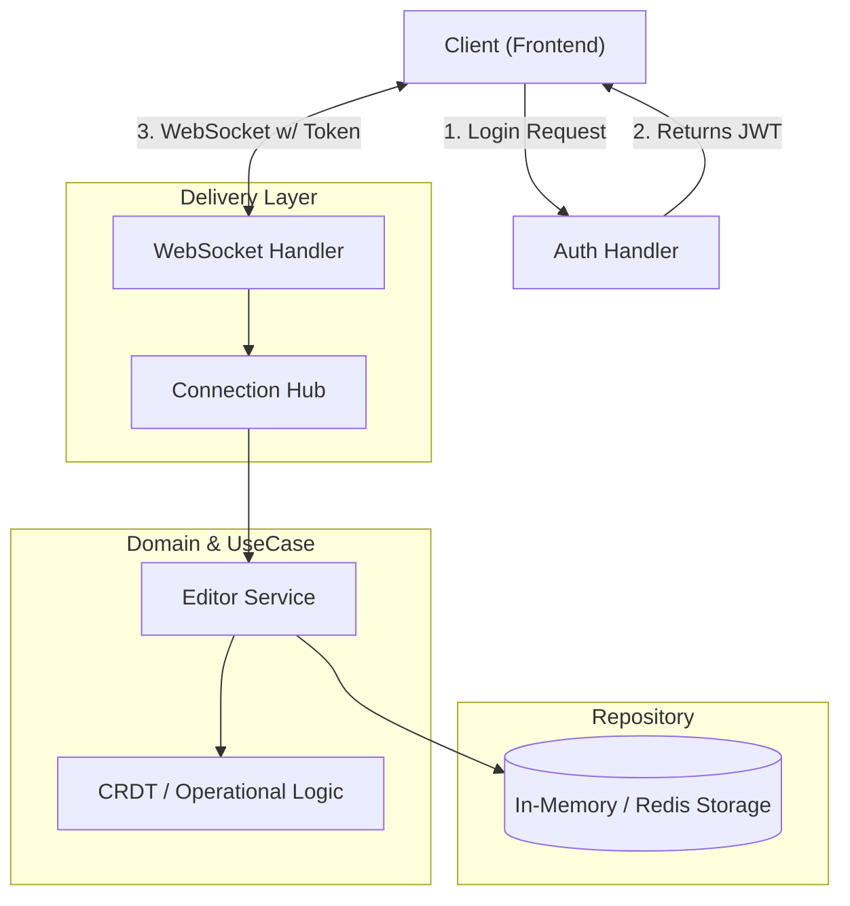

# ⚡ GoCollab: Real-Time Collaborative Editor Backend


> A high-performance, concurrency-safe backend service that powers real-time collaborative editing (similar to Google Docs), built with **Go**, **WebSockets**, and **JWT Authentication**.

---

## 🏗️ System Architecture

This project follows **Clean Architecture** principles to separate business logic from the transport layer.



## 🚀 Features
* **Real-time Synchronization:** Uses WebSockets for low-latency, bi-directional communication.
* **Secure Authentication:** Uses JWT (JSON Web Tokens) to verify user identity before establishing a WebSocket connection.
* **Concurrency Safe:** Implements sync.Mutex and Channels to handle multiple users editing the same document simultaneously without race conditions.
* **Clean Architecture:** Code is modular (domain, usecase, repository, delivery), making it testable and scalable.
* **Conflict Resolution:** (Basic) Handles operation merging to ensure eventual consistency.
* **Room Support:** Users can join specific document rooms (e.g., ?room=doc1).

## 🛠️ Tech Stack

| Category | Technology |
| :--- | :--- |
| **Backend** |  |
| **Protocol** |  |
| **Database** |  |
| **Tools** |  |

## 📂 Project Structure

```text
├── cmd
│   └── server          # Main entry point (starts the app)
├── internal
│   ├── domain          # Core logic & Entities (Document struct)
│   ├── usecase         # Business rules (ProcessEdit)
│   ├── repository      # Database storage (Memory/Redis)
│   └── delivery        # Websockets & HTTP handlers
├── go.mod              # Dependencies
└── README.md           # Documentation

---
```

## ⚡ Getting Started

### 1. Clone the Repository
```bash
git clone [https://github.com/Kunal-3004/go-collab-editor.git](https://github.com/Kunal-3004/go-collab-editor.git)
cd go-collab-editor
```

### 2. Install Dependencies
```bash
go mod tidy
```
### 3. Run the Server
```bash
go run cmd/server/main.go
```
You should see a message: Server started on :8000

Render on : https://cool-editor.onrender.com


## 🔮 Future Improvements
* **[ ] Redis Integration:** Replace in-memory storage with Redis for persistence.
* **[ ] Docker Support:** Add Dockerfile and docker-compose for easy deployment.
* **[ ] Advanced Conflict Resolution:** Upgrade from basic logic to full CRDT (Conflict-free Replicated Data Types) using libraries like Yjs.


<p align="center"> Made with ❤️ by <a href="https://www.google.com/search?q=https://github.com/Kunal-3004">Kunal</a> </p>

